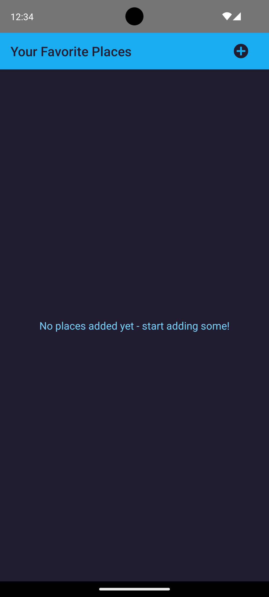
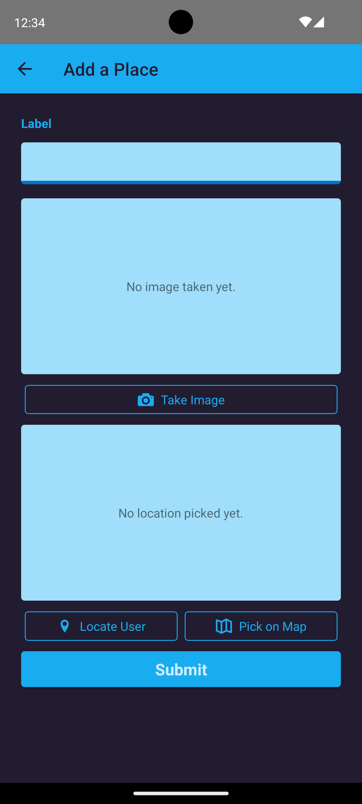
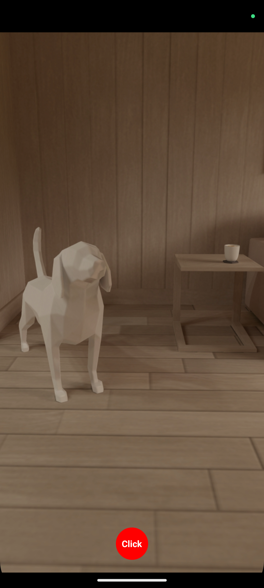
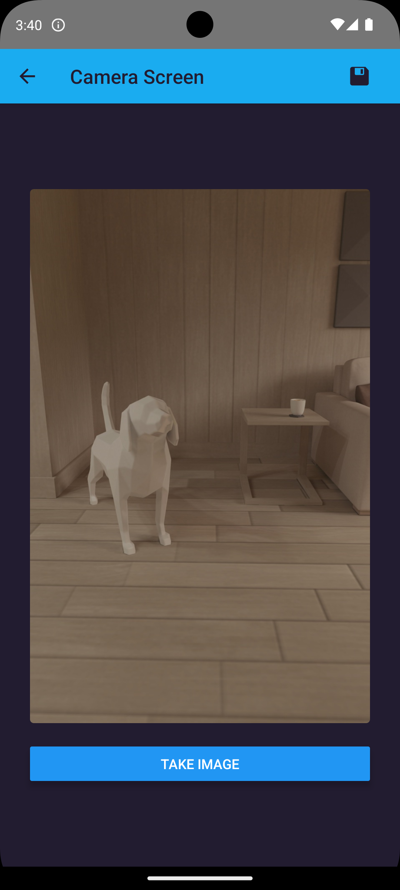
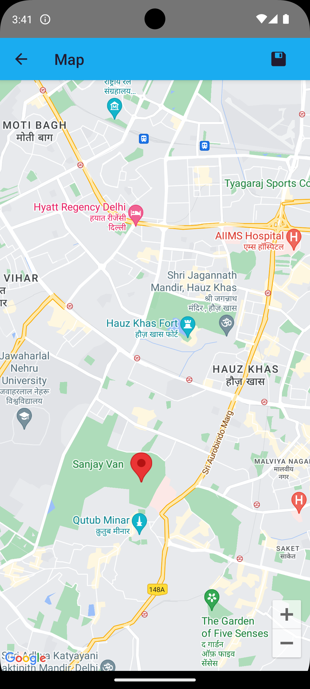
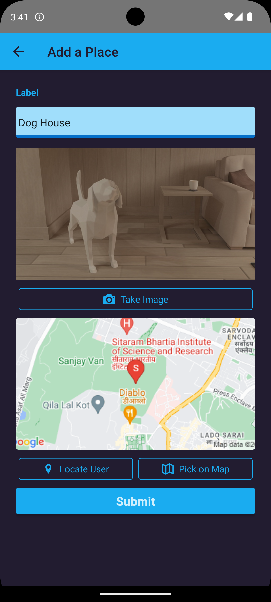

# Expense Manager

My Places is a React Native application that allows users to save their favorite places with titles, images, and addresses. Users can add new places using a form, which includes options to take a picture with the camera or choose an image from the device's gallery. Additionally, users can set the location of the place by selecting it on a map. 

This is a new [**React Native**](https://reactnative.dev) project, bootstrapped using [`@react-native-community/cli`](https://github.com/react-native-community/cli).

## Features
- **List of Saved Places:** List of Saved Places: View a list of all the saved places with their titles, images, and addresses on the home screen.
- **Add New Place:** Use the form on the second screen to add a new place to your favorites.
- **Camera Integration:** Capture images for your places using the device's camera.
- **Image Picker:** Choose images or click using your device's camera.
- **Location Services:** Access the user's current location and mark your desired favorite place location on a map.
- **Nested Navigation**
- Custom Pressable Button Component
- FlatList for displaying your favorite places lists
- Utilizes latest JavaScript and React features
- Styled with React Native StyleSheet
- Implemented using React Hooks
- Cross-platform code for Android and iOS
- Latest features of JavaScript i.e. ES8 is used


### Few Screenshots

   




# Getting Started

>**Note**: Make sure you have completed the [React Native - Environment Setup](https://reactnative.dev/docs/environment-setup) instructions till "Creating a new application" step, before proceeding.

## Step 1: Start the Metro Server

First, you will need to start **Metro**, the JavaScript _bundler_ that ships _with_ React Native.

To start Metro, run the following command from the _root_ of your React Native project:

```bash
# using npm
npm start

# OR using Yarn
yarn start
```
## Demo 


## Step 2: Start your Application

Let Metro Bundler run in its _own_ terminal. Open a _new_ terminal from the _root_ of your React Native project. Run the following command to start your _Android_ or _iOS_ app:

### For Android

```bash
# using npm
npm run android

# OR using Yarn
yarn android
```

### For iOS

```bash
# using npm
npm run ios

# OR using Yarn
yarn ios
```

If everything is set up _correctly_, you should see your new app running in your _Android Emulator_ or _iOS Simulator_ shortly provided you have set up your emulator/simulator correctly.

This is one way to run your app — you can also run it directly from within Android Studio and Xcode respectively.
